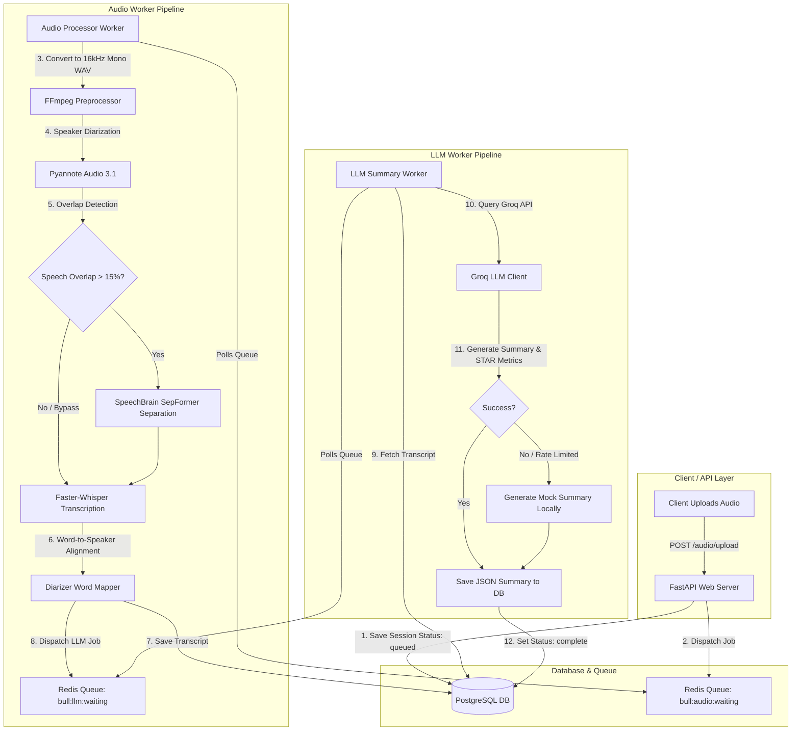
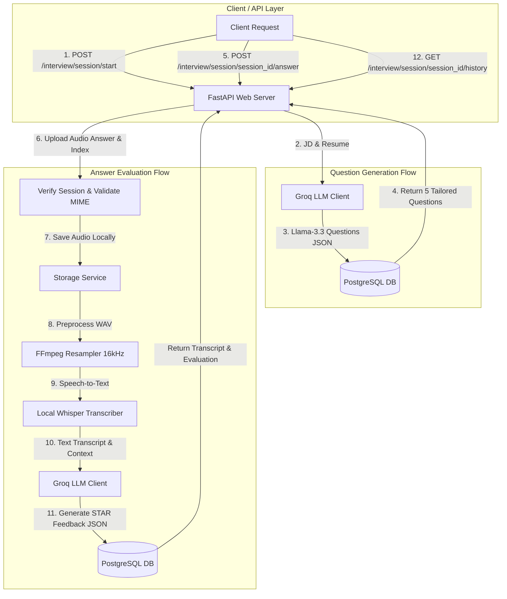

# Intellimeet — AI Meeting Summarizer & Interview Prep

Intellimeet is an intelligent, high-performance meeting assistant and interview preparation backend built with FastAPI, Redis, PostgreSQL, and state-of-the-art open-source AI models. It handles everything from raw audio upload, speaker separation, speaker diarization, word-level speech-to-text transcription, and LLM-powered meeting insights.

---

## 🏗️ System Architecture & Workflow

Here is the detailed flow of how an audio file is ingested, processed by the AI pipeline, and summarized:



### 🎯 Interview Prep Pipeline

For custom technical/behavioral interview preparation, candidate responses are processed synchronously to provide fast evaluation and feedback:



---

## 🛠️ Tech Stack & Key Components

1. **Web Framework**: FastAPI (Async handlers, Pydantic data validation, JWT authentication).
2. **Task Ingestion & Queueing**: Redis with an asynchronous list-based queue pipeline (`bull:audio:waiting` and `bull:llm:waiting`).
3. **Storage**: PostgreSQL (SQLAlchemy + asyncpg for async DB operations) and local absolute-path storage for audio uploads.
4. **AI Audio Preprocessing**: Gyan FFmpeg (volume normalization, resampling to 16kHz, mono downmixing) and PyDub (chunk slicing).
5. **Speaker Diarization**: Pyannote Audio 3.1 (with Windows-compatible monkeypatches replacing `torchcodec` with `soundfile`).
6. **Speech Separation**: SpeechBrain SepFormer (gates audio separation if speaker overlaps exceed 15%).
7. **Speech-to-Text**: Faster-Whisper (retrieves word-level timestamps and deduplicates overlapping windows).
8. **Summarization**: Groq API (`llama-3.3-70b-versatile` / `llama-3.1-70b-versatile` with rule-based keyword fallback on rate limits or API key issues).

---

## 🚀 Setup & Installation

### 1. Prerequisites
- **Python**: v3.10 to v3.12 (highly recommended).
- **PostgreSQL**: Running instance.
- **Redis**: Running on `localhost:6379`.
- **FFmpeg**: Installed on your path (on Windows, standard `Gyan.FFmpeg` is supported).

### 2. Clone and Setup Environment
Inside the project directory:
```bash
# Create and activate virtual environment
python -m venv venv
venv\Scripts\activate  # On Windows

# Install dependencies
pip install -r requirements.txt
```

### 3. Environment Variables
Create a `Backend/.env` file with the following parameters:
```env
# Database
DATABASE_URL=postgresql+asyncpg://<username>:<password>@localhost:5432/<dbname>

# Redis
REDIS_URL=redis://localhost:6379/0

# Authentication
JWT_SECRET_KEY=your_super_secret_jwt_key
JWT_ACCESS_TOKEN_EXPIRE_MINUTES=30
JWT_REFRESH_TOKEN_EXPIRE_DAYS=7

# Audio Storage
UPLOAD_DIR=./uploads
MAX_UPLOAD_SIZE_MB=500

# Whisper (Speech-to-Text)
WHISPER_MODEL=base
USE_GPU=false

# Groq API (LLM Summarization)
GROQ_API_KEY=gsk_your_groq_api_key

# HuggingFace (For Pyannote Diarization Model)
HUGGINGFACE_TOKEN=hf_your_huggingface_token
```

### 4. Run Migrations
Generate database tables:
```bash
cd Backend
alembic upgrade head
```

---

## 🏃 Running the Application

To run the full pipeline, start the FastAPI web server and both AI background workers in three separate terminal instances:

### 1. Start the API Server
```bash
cd Backend
uvicorn app.main:app --reload
```
*API docs will be available at: http://127.0.0.1:8000/docs*

### 2. Start the Audio Worker
```bash
cd Backend
python workers/audio_processor/worker.py
```

### 3. Start the LLM Worker
```bash
cd Backend
python workers/llm_processor/worker.py
```

---

## 🔑 Key API Endpoints Reference

### 🔐 Authentication Router
* `POST /auth/register` — Create a new user account.
* `POST /auth/login` — Log in and receive access/refresh tokens.
* `POST /auth/refresh` — Issue a new access token using a refresh token.

### 🎙️ Audio Ingestion Router
* `POST /audio/upload` — Upload an audio file (supports WAV, MP3, M4A, OGG). Dispatches the session immediately into the background processing queue.

### 📅 Meetings Management Router
* `GET /meetings/` — List all meetings uploaded by the current user.
* `GET /meetings/{session_id}` — Fetch detailed statistics, speaker-labeled transcripts, and the final LLM-generated summary.
* `DELETE /meetings/{session_id}` — Deletes the meeting session, database records, and physical audio files.

### 🎯 Interview Prep Router
* `POST /interview/session/start` — Start a practice session by uploading a Job Description and Resume to generate 5 custom questions.
* `POST /interview/session/{session_id}/answer` — Submit an audio answer for a specific question to transcribe it locally and evaluate it using STAR criteria.
* `GET /interview/session/{session_id}/history` — Fetch the complete history of questions, audio attempts, and evaluation scores for the session.
