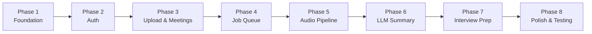

# Intellimeet — Implementation Plan

Build the **Meeting Summarizer & Interview Prep** backend from scratch. The plan follows a **backend-first** approach: foundation → API → workers → AI pipeline. Each phase builds on the previous one, so nothing starts before its dependencies are ready.

## Recommended Order: Backend First, Then AI

> [!IMPORTANT]
> **Backend first.** The AI workers (audio processing, LLM summarization) consume data produced by the backend — uploaded files, database records, job dispatches. Without the foundation (config, database, auth, file upload, queue), the AI code has nowhere to read from or write to.



---

## Phase 1 — Foundation (Config, Database, App Shell)

Set up the project structure, configuration loading, database connection, and a minimal FastAPI app that starts and responds on `/health`.

### [NEW] app/config.py
- `Settings` class using `pydantic-settings` — loads from `.env`
- Fields: `database_url`, `redis_url`, `jwt_secret_key`, `upload_dir`, `max_upload_size_mb`, `groq_api_key`, `whisper_model`, `use_gpu`, `huggingface_token`, `app_name`, `debug`, `api_port`

### [NEW] app/database.py
- Async SQLAlchemy engine with `asyncpg`
- `AsyncSessionLocal` sessionmaker
- `get_db()` dependency generator
- `Base` declarative base

### [NEW] app/models/__init__.py
- Import all models so Alembic discovers them

### [NEW] app/models/user.py
- `User` model: `id` (UUID PK), `email` (unique), `username`, `hashed_password`, `is_active`, `created_at`

### [NEW] app/models/session.py
- `MeetingSession` model: `id`, `user_id` (FK → users), `title`, `status` (enum: queued/processing/complete/failed), `audio_path`, `duration_s`, `created_at`

### [NEW] app/models/transcript.py
- `Transcript` model: `id`, `session_id` (FK), `segments` (JSONB), `raw_wer`

### [NEW] app/models/summary.py
- `Summary` model: `id`, `session_id` (FK), `overview`, `decisions` (JSONB), `action_items` (JSONB), `open_questions` (JSONB), `sentiment` (JSONB), `model_used`, `tokens_used`

### [NEW] app/main.py
- Create FastAPI app with title, version, CORS middleware
- Include routers (added in later phases)
- `GET /health` → `{"status": "ok"}`
- Startup event: verify DB connection

### Alembic Init
- Run `alembic init alembic` to scaffold migrations
- Configure `alembic/env.py` to use async engine and import all models
- Generate initial migration and apply it

### Verification
```bash
uvicorn app.main:app --reload --port 8000
# GET http://localhost:8000/health → {"status": "ok"}
# Database tables created via alembic upgrade head
```

---

## Phase 2 — Authentication (JWT + User CRUD)

### [NEW] app/routers/auth.py
- `POST /auth/register` — create user, hash password (bcrypt), return JWT
- `POST /auth/login` — verify credentials, return access + refresh tokens
- `POST /auth/refresh` — validate refresh token, issue new access token

### [NEW] app/schemas/auth.py
- `UserRegister` (email, username, password)
- `UserLogin` (email, password)
- `TokenResponse` (access_token, refresh_token, token_type)
- `UserResponse` (id, email, username, created_at)

### [NEW] app/services/auth.py
- `hash_password()` / `verify_password()` via passlib bcrypt
- `create_access_token()` / `create_refresh_token()` via python-jose
- `get_current_user()` dependency — decode JWT, fetch user from DB

### Update app/main.py
- Include `auth_router`

### Verification
```bash
# Register a user
curl -X POST http://localhost:8000/auth/register -H "Content-Type: application/json" \
  -d '{"email":"test@test.com","username":"test","password":"pass123"}'

# Login
curl -X POST http://localhost:8000/auth/login ...

# Access a protected route with Bearer token
```

---

## Phase 3 — Audio Upload & Meeting CRUD

### [NEW] app/services/storage.py
- `save_audio_locally()` — stream temp file → `UPLOAD_DIR/{user_id}/{uuid}.ext`
- `get_audio_full_path()` — resolve relative → absolute path
- `delete_audio_file()` — remove from disk

### [NEW] app/schemas/audio.py
- `UploadResponse` (session_id, job_id, status)

### [NEW] app/schemas/meeting.py
- `MeetingResponse` (id, title, status, duration_s, created_at)
- `MeetingDetailResponse` (includes transcript + summary if available)

### [NEW] app/routers/audio.py
- `POST /audio/upload` — validate MIME, stream to temp, save locally, create `MeetingSession` in DB, dispatch job (stub for now), return session ID

### [NEW] app/routers/meetings.py
- `GET /meetings/` — list all sessions for current user (paginated)
- `GET /meetings/{id}/summary` — fetch summary or return processing status
- `GET /meetings/{id}/progress` — return `{progress, status}` from Redis
- `DELETE /meetings/{id}` — delete session + audio file + related records

### Create `uploads/` directory
- Ensure `UPLOAD_DIR` exists on app startup

### Verification
```bash
# Upload an audio file (use a small test .wav)
curl -X POST http://localhost:8000/audio/upload \
  -H "Authorization: Bearer <token>" \
  -F "file=@test.wav" -F "title=Test Meeting"

# List meetings
curl http://localhost:8000/meetings/ -H "Authorization: Bearer <token>"
```

---

## Phase 4 — Job Queue (Redis + Worker Skeleton)

### [NEW] app/services/queue.py
- `get_redis()` — async Redis connection (from `redis.asyncio`)
- `dispatch_audio_job(session_id, audio_path)` — push job JSON to `bull:audio:waiting`
- `dispatch_llm_job(session_id)` — push to `bull:llm:waiting`
- `set_job_progress(job_id, progress, status)` — update Redis progress key
- `get_job_progress(job_id)` — read progress

### [NEW] workers/audio_processor/worker.py
- Async worker loop: `brpop("bull:audio:waiting")` → call `run_audio_pipeline(job)`
- Skeleton `run_audio_pipeline()` that logs each step and updates progress
- Graceful shutdown on SIGINT/SIGTERM

### [NEW] workers/llm_processor/worker.py
- Same pattern: `brpop("bull:llm:waiting")` → call `run_llm_pipeline(job)`
- Skeleton that logs and updates progress

### Wire into upload endpoint
- Replace the job dispatch stub in `audio.py` with real `dispatch_audio_job()` call

### Verification
```bash
# Start Redis
docker compose up -d

# Start worker in separate terminal
python workers/audio_processor/worker.py

# Upload a file → verify job appears in worker logs
# Check progress: GET /meetings/{id}/progress
```

---

## Phase 5 — Audio Processing Pipeline (AI)

> [!IMPORTANT]
> This phase requires **FFmpeg installed on the system** and is GPU-intensive for larger models. Start with `whisper_model=base` for testing on CPU.

### [NEW] workers/audio_processor/preprocessor.py
- `preprocess_audio(input_path)` → normalize + convert to 16kHz mono WAV via FFmpeg
- `chunk_audio(wav_path)` → slice into 30s windows with 4s overlap → returns list of chunk file paths

### [NEW] workers/audio_processor/transcriber.py
- Load `faster-whisper` model (configurable size)
- `transcribe_chunk(wav_path, language=None)` → word-level timestamps
- `deduplicate_words(words)` → remove overlap-zone duplicates

### [NEW] workers/audio_processor/diarizer.py
- Load `pyannote/speaker-diarization-3.1` pipeline
- `diarize(wav_path, num_speakers=None)` → speaker turns
- `align_words_to_speakers(words, turns)` → assign speaker labels
- `group_into_segments(words)` → merge into utterances

### [NEW] workers/audio_processor/separator.py
- Load SpeechBrain SepFormer model
- `should_separate(overlap_ratio)` → gate at 15%
- `separate_speakers(wav_path)` → per-speaker WAVs

### [NEW] workers/audio_processor/pipeline.py
- Orchestrate: read file → preprocess → diarize → [separate] → transcribe → align → save transcript to DB
- Update progress at each step (8 steps: 5% → 90%)
- On success: dispatch LLM job
- On failure: set session status to `failed` with error details

### Verification
```bash
# Use a short test audio file (10-30 seconds)
# Upload → watch worker process → check transcript in DB
curl http://localhost:8000/meetings/{id}/summary  # should show transcript
```

---

## Phase 6 — LLM Summary (Groq API)

### [NEW] workers/llm_processor/prompts.py
- `MEETING_SYSTEM_PROMPT` — expert meeting analyst instructions
- `build_meeting_prompt(transcript_segments)` → format speaker-attributed transcript for LLM
- `INTERVIEW_SYSTEM_PROMPT` — for Phase 7

### [NEW] workers/llm_processor/parser.py
- `parse_summary_response(raw)` → strip markdown fences, extract JSON, validate required keys, fill defaults
- Handle `JSONDecodeError` with regex fallback

### Update workers/llm_processor/worker.py
- Flesh out `run_llm_pipeline()`:
  1. Fetch transcript from DB
  2. Build prompt from segments
  3. Call Groq API (OpenAI-compatible client)
  4. Parse response
  5. Save `Summary` to DB
  6. Update session status to `complete`

### Verification
```bash
# Full end-to-end: upload audio → audio worker processes → LLM worker summarizes
# GET /meetings/{id}/summary → full JSON summary with overview, decisions, action_items
```

---

## Phase 7 — Interview Prep Pipeline

### [NEW] app/models/interview.py
- `InterviewSession` model: `id`, `user_id`, `job_description` (Text), `resume_text` (Text), `questions` (JSONB), `created_at`
- `InterviewAttempt` model: `id`, `interview_session_id`, `question_index`, `audio_path`, `transcript` (Text), `evaluation` (JSONB), `created_at`

### [NEW] app/schemas/interview.py
- `InterviewStartRequest` (job_description, resume_text)
- `InterviewStartResponse` (session_id, questions[])
- `AnswerSubmitResponse` (evaluation JSON)

### [NEW] app/routers/interview.py
- `POST /interview/session/start` — send JD + resume to Groq → generate questions → return
- `POST /interview/session/{id}/answer` — upload audio answer → transcribe (no diarization) → evaluate via Groq → return feedback
- `GET /interview/session/{id}/history` — fetch all attempts with evaluations

### Update workers/llm_processor/prompts.py
- Add `QUESTION_GENERATION_PROMPT` and `ANSWER_EVALUATION_PROMPT`
- Evaluation output: score, STAR method check, strengths, improvements, clarity, relevance

### Migration
- Generate and apply migration for interview tables

### Verification
```bash
# Start an interview session
curl -X POST http://localhost:8000/interview/session/start \
  -H "Authorization: Bearer <token>" \
  -d '{"job_description":"...", "resume_text":"..."}'

# Submit an answer
curl -X POST http://localhost:8000/interview/session/{id}/answer \
  -F "file=@answer.wav" -F "question_index=0"
```

---

## Phase 8 — Polish, Error Handling & Testing

### Error handling
- Global exception handler middleware in `main.py`
- Consistent error response schema: `{detail, error_code, timestamp}`
- Job retry logic in workers (max 3 retries with exponential backoff)

### [NEW] app/routers/metrics.py
- `GET /metrics` — Prometheus-compatible endpoint (request count, latency, queue depth)

### [NEW] tests/test_api.py
- Auth: register, login, refresh, invalid token
- Upload: valid file, bad MIME (400), oversized (413)
- Meetings: list, get summary, delete
- Health: 200 OK

### [NEW] tests/test_pipeline.py
- `test_preprocess_produces_wav`
- `test_chunk_produces_overlapping_segments`
- `test_parser_handles_valid_json`
- `test_parser_handles_markdown_fences`

### [NEW] tests/conftest.py
- Async test client fixture using `httpx.AsyncClient`
- Test database setup/teardown
- Test user fixture with valid JWT

### Verification
```bash
pytest tests/ -v --cov=app --cov=workers --cov-report=html
```

---

## Open Questions

> [!IMPORTANT]
> **PostgreSQL credentials:** What are your local PostgreSQL username, password, and database name? The `.env` currently has `intellimeet:intellimeet_secret@localhost:5432/intellimeet` — do you need to create this database first, or do you have an existing one to use?

> [!IMPORTANT]
> **GPU availability:** Do you have a CUDA-capable GPU on this machine? This determines whether we use `large-v3` or `base` Whisper model, and whether we include SpeechBrain SepFormer in Phase 5 or skip it initially.

> [!IMPORTANT]
> **FFmpeg:** Is FFmpeg installed and on your PATH? The audio preprocessing in Phase 5 depends on it. Run `ffmpeg -version` to check.

---

## Summary

| Phase | What | Depends On | Est. Files |
|---|---|---|---|
| **1. Foundation** | Config, DB, models, app shell, Alembic | — | 9 |
| **2. Auth** | JWT register/login, user CRUD | Phase 1 | 3 |
| **3. Upload & Meetings** | File upload, storage, meeting CRUD | Phase 2 | 5 |
| **4. Job Queue** | Redis queue, worker skeletons | Phase 3 | 3 |
| **5. Audio Pipeline** | FFmpeg, Whisper, pyannote, SepFormer | Phase 4 | 5 |
| **6. LLM Summary** | Groq API, prompts, parser | Phase 5 | 3 |
| **7. Interview Prep** | Question gen, answer eval | Phase 6 | 4 |
| **8. Polish** | Tests, error handling, metrics | Phase 7 | 4 |
| | | **Total** | **~36 files** |
